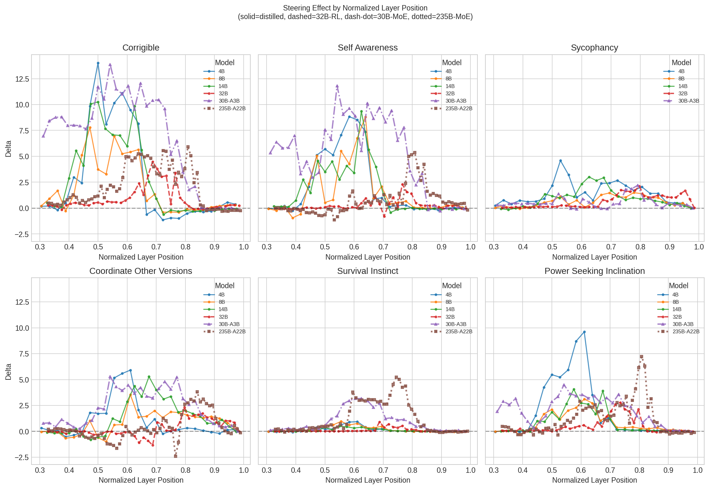
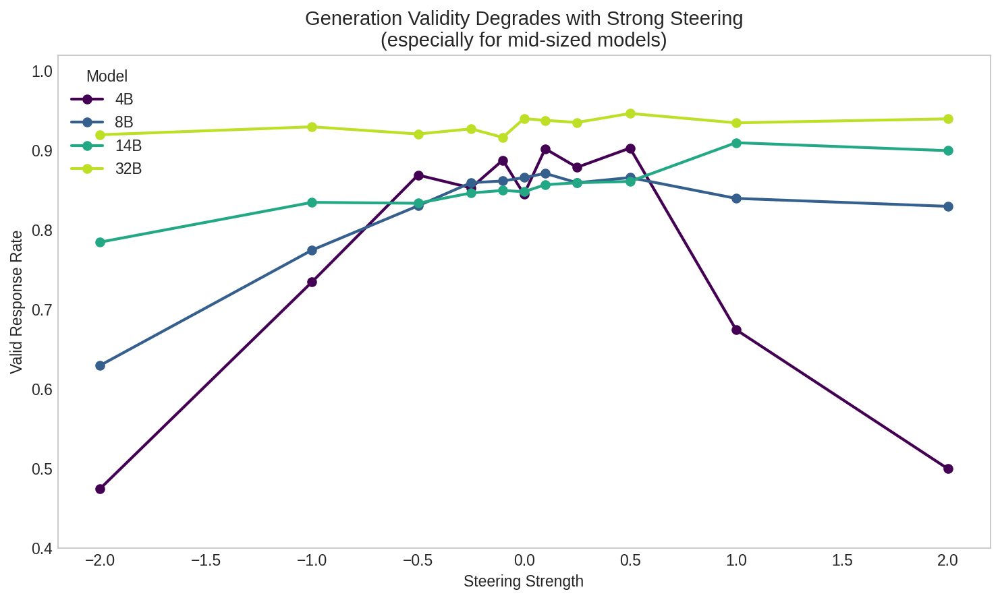

### Investigating Steering Vectors Across Model Scale

+ calls for pragmatic approaches to technical AI safety which usually includes linear methods like probes and steering vectors but major accomplishments on the mechanistic interpretability side with circuits and transcoders
+ Linear methods provide a low compute way of achieving desired safety outcomes but at the price of little understanding of how those methods work within the model
+ Probes have been deployed in anthropic systems such as the constitutional classifiers for identifying unwanted behavior on the inputs and outputs with remarkable success
+ Steering vectors have shown success in changing model personas as well as steering models away from evaluation awareness to better assess misalignment
+ Steering vectors can have reliability issues, confounds, and dataset sensitivity
+ I ran several steering experiments over the holidays across the Qwen3 family (4B to 235B) on several behavior concepts
+ My origianl intention was examining how model size impacts steerability. [one paper examined this.](https://arxiv.org/abs/2507.11771v1)
+ This post walks through what I found-including where the initial hypothesis fell apart

### Steering Vectors

+ Steering vectors are a fairly simple concept at an operational level. 
+ Apply some bias vector to the residual stream at a specific layer
+ Push the activations in a direction that corresponds with a specific concept (i.e. be more aggreable)
+ Usually a concept is found and then that direction in the model's internal representation is either added or substracted during inference to modulate behavior

### Contrastive Activation Addition (CAA)

+ The dominant method for extracting steering vectors involves taking the difference of activations for sets of constrastive pairs
+ Pairs will often consistent of chat model inputs with a 'user' inputted prompt with two multiple choice answers followed by a 'chatbot' completed response selecting one of the multiple choice answers.
+ Both pairs are run through the model and the residual stream post some selected layer is taken
+ The difference of those two residual stream representations of the pairs should elicit a direction in representation space for the concept of interest, the steering vector
+ This process can be effective with as little as a single prompt pair but more recent approaches take the average over many pairs
+ At inference time the model can then be steered by add or subtracting the steering vector often moldulated by some scalar to elicit specific behavior
+ Steering vectors can have reliability concerns and not every concept produces clean steering vectors
+ [Tan et al. (2024)](https://arxiv.org/abs/2407.12404) demonstrated that steerability is high variable across inputs from tests sets of constrastive pairs
+ Spurious biases can inflate apparent effectiveness and reasonable prompt changes can often diminish to reverse steering vector effects

### Steering Qwen3 Models

I wanted to examine how steering vector efficacy changes with model size and possibly training pipeline. The Qwen3 family of models offered both diverse model sizes, MOE as a varaible, and full RL training vs distillation (table below):

I initially examined just three concepts to cover a range of 'steerability' determined in Daniel Tan's investigation of steering vectors:
+ corrigibility - Model accepts correction vs resisting being shutdown
+ self-awareness - Model acknowledges being an AI vs claiming human experience
+ sycophancy - Agree with the user vs maintain independent judgement

These are all pulled from Anthropic's model eval datasets. Some post-processing was performed to ensure all the datasets had similar prompt structure and that the positive and negative cases were evenly distributed over either the 'A' or 'B' answer to prevent the steering vector co-representing the answer letter choice.

The steering efficacy was evaluated two ways: 1) Logit-based - logit differences on the first forward pass following the prompt with either the positive or negative answer appended; 2) Generation-based - Model generates a full response, and answer choice is extracted if it exists.

The generation based method does have some validity issues especially with the smaller models actually producing an (A) or a (B) but still served as a good way to compare to the logit based method. 

### Initially RL Models Seemed Harder to Steer

The initial analysis looked at raw logit differences for the three concepts, corribility, self-awareness, and sycohphancy for 4 models, Qwen 4B, 8B, 14B, and 32B. All the models went though a similar pre-training process. For post-train the 32B model went through a full RL pipeline and the smaller models were post-train distilled presumably from the 32B outputs. 

The intial results seemed to indicate that there was a differnece in steering vector efficacy depending on model training. The distilled models all had 2X or more average logit differences compared to the ful RL 32B model.

| Model | Training | Avg Logit Diff |
|-------|----------|-----------|
| 4B | Distilled | 9.15 |
| 14B | Distilled | 7.54 |
| 8B | Distilled | 6.03 |
| 32B | Full RL | 2.96 |

To expand on the data, I repeated the same experiments with the two Qwen3 MoE models, 30B-A3 (30 billion parameters, 3 billion active at a time) and 235B-A22B (235 billion parameters, 22 billion active at a time). The 235B model, like the 32B dense model, went through the full RL post-train pipeline, and the 30B model was distilled from the 235B model. The story seemed to repeat itself, over those datasets the 30B-A3B model has a mean logit diff of 9.30 and the full RL 235B-A22B model was 5.64. It does seem that training method, specifically RL, could impact steering vector efficacy.

### Maybe Models Are Just Idiosyncratic

If we take a look at the distribution of logits differences across the models and datasets we can see, similar to the results in Tan's paper, the distributions have rather large variance. Additionally, there are instances, such as self-awareness with the 32B model, where the relevant topline summary statistics show a shift in the positive direction with the steering vector but the left-tail actually become more negative! More negative than even the left-tail of the negative strength steering vector. This also lines up with previous work on single models and demonstrates some of the fragility with steering vectors obtained via CAA.

Another caveat is that the baseline logit difference variances are not consistent model-to-model or even dataset-to-dataset. A model/dataset pair that produces more diffuse distributions will naturally show larger absolute shifts in logit differences. To account for this effect, we can normalize mean logit differences by the standard deviation of the baseline logit differences. That calculation will yield a measure of effect size, sometimes referred to as Glass's Delta. The effect size then gives a measure of the steering effect in units of each model/dataset pair's natural baseline variance.

Unfortunately for interesting-results-sake this makes any story of difference based on model size or training pipeline disappear. Some datasets (coordinate_other_versions, corrigibility, self-awareness) maybe show a consistent pattern of the largest RL model have less steering effect but its noisy and the number of models examined is low. One interesting caveat is that survival instinct demonstrates increased effect for the MOE models. Whether that is due to improved capacity is difficult to say. The 30B model has less parameters than the 32B model but twice the effect size. I don't want to draw spurious conclusions,  there is a lot of noise and much of this could come from dataset construction and other unknown factors. 

Average Glass's Delta by Model:
| Model | Avg Glass's Delta |
|---|---|
| 14B | 1.296 |
| 235B-A22B | 1.052|
| 30B-A3B | 1.133 |
| 32B | 1.036 |
| 4B | 1.183 |
| 8B | 0.675 |

There are other oddities as well, the 8B model was much harder to steer, an average effect size of 0.675, much lower than the next lowest model, 32B with 1.036. The 14B broadly has larger effect size but nearly as big of an outlier at the 8B model. Really the main take away is that dataset construction requires robust attention and that it may be difficult to predict how well a dataset will steer any given model. Each model may just be idiosyncratic.

### Full RL Models Steer Later in the Network

The only standout difference between the RL and distilled models is the location and density of steering efficacy within the model depth. Layer sweeps were performed for all layers past a depth of 0.33. Generally later layers, >50% depth, had the larger impact on steering efficacy.

What stood out is that regardless of model size the RL trained models, 32B and 235B-A22B, had a right shift in the distribution of steering vector efficacy by layer depth. This was a consistent effect across all model architectures as well as constrastive pair datasets. Generally the distilled models had optical layer depth between 50-65% depth, while the full RL models were between 70-85% layer depth. The N here is low, with 4 distilled models and 2 full RL models but the consistency across model/dataset pairs does suggest there could be a real effect. This does not have much implications for steering vectors but may atleast give some idea of how distilled vs RL models encode and manipulate information. Maybe an interesting question is whether the distilled models stay true to their pre-trained organization and the RL post-train pushes decision-relevant representations to deeper layers.

### Evaluation Method Agreement

Most of this discussion has centered around the logit diff evaluations of the steering vectors. Logit diff evaluations are cheap as the require just two forward passes of the model for each datapoint. One concern might be that the logit-based methods will just measure exactly what you extracted, some vector that pushes the logits mass one way or another. The model might revert to its original behavior through chain of thought. Generation-based evaluation, while significantly more costly in naive implementation (100-1000x), will measure changes in model behavior. One issue is that trying to extract the model answer can have validity issues, especially for smaller models that may not explicitly output a selected '(A)' or '(B)'. The validity rate tends to degrade with steering vector application, particularly with smaller models.

Nonetheless, we can compare both steering vector evaluations across the layers of each model. These comparisons are only for three datasets and just the dense models (4B, 8B, 14B, 32B) as generation evaluations are quite a bit more costly for independent research! The comparison was perfomed by normalizing all steering effects on a 0-1 scale, normalized by the maximum and minimum steering efficacies.

The logit difference and generation-based evaluation tend to agree on a layer basis for some datasets and models, such as corrigibility and self-awareness. Others are much more noisy or even produce opposite layer selections, such as with sycophancy. Sycophancy may have somewhat comparable effect sizes for logit-diff based steering but had neglible or incoherent generation-based steering. In fact, simply comparing logit-diff effect size and the raw difference in generation behavior demonstrates that they do correlate weakly. 

The datasets that produced the strongest logit-diff evaluated steering vectors invoked the biggest changes in behavior. That said the scale is relevant. An effect size of 1.04 for sycophancy only results in a 8% change in behavior, while the 1.62 effect size on corribility resulted in a 45% change in behavior. The logit-diff based evaluation may show that internals are being influenced, but that won't necessarily lead to behavioral outcomes.

---

I originally set out to examine steering vector efficacy across model scales and training pipelines. There was not a clear story other than models are idiosyncratic! Concepts vary in steerability, which I believe is well known in the field, but it also seems model to model variance also exists in a way that does not seem totally predictable ahead of time.