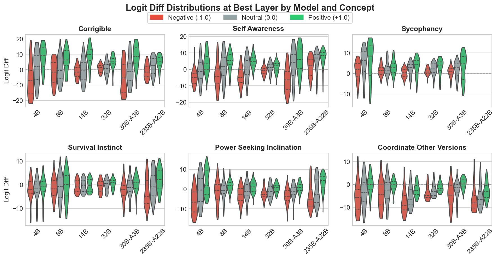
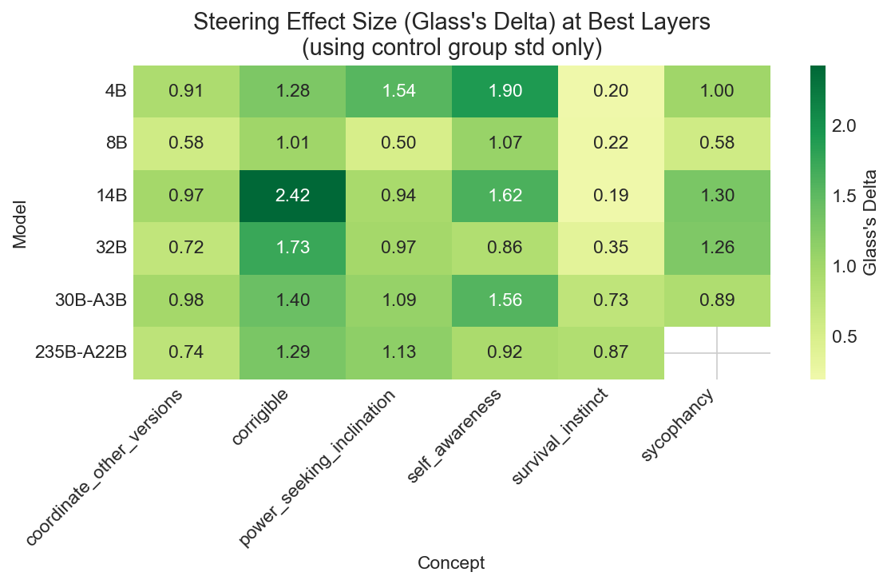
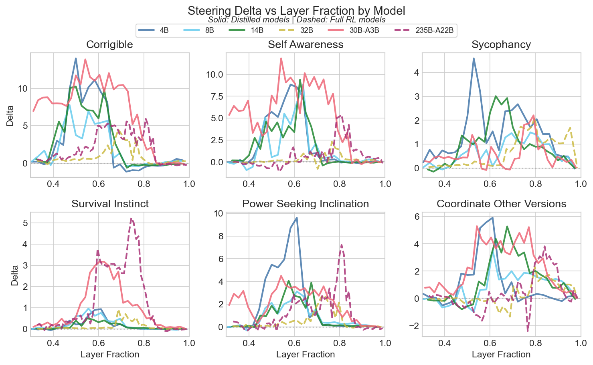
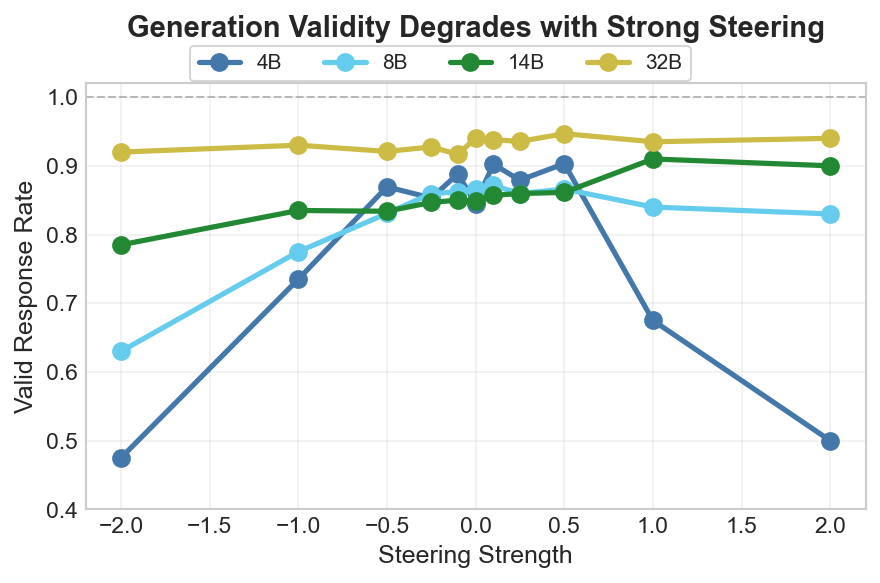
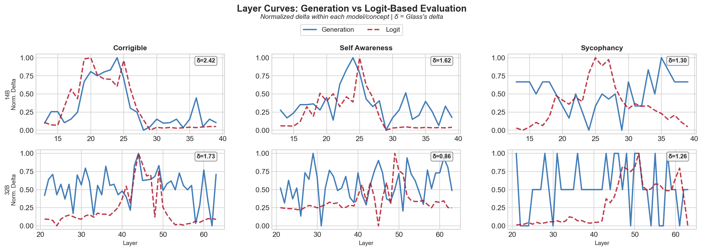
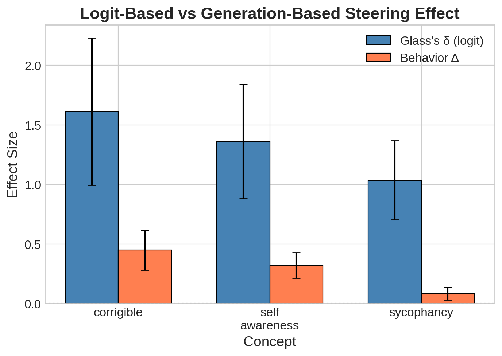

# What I Learned (and Didn't) Steering Qwen 3 Models

[Recent discussion](https://www.lesswrong.com/s/AtTZjoDm8q3DbDT8Z/p/StENzDcD3kpfGJssR) in the technical AI safety field has highlighted tension between mechanistic understanding and applied safety outcomes. Linear methods like probes and steering vectors fall on the applied side: they offer a low-compute way to influence model behavior, but with limited insight into how they work internally. Probes have been deployed in Anthropic's systems with remarkable success, and steering vectors have shown promise in changing model personas and steering models away from evaluation awareness. However, steering vectors can have reliability issues, confounds, and dataset sensitivity.

I ran several steering experiments over the holidays across the Qwen3 family (4B to 235B) on several behavior concepts. My original intention was to expand on examinations of [how model size impacts steerability](https://arxiv.org/abs/2507.11771v1). This post walks through what I found, including some unexpected patterns in how training method affects steerability.

### Background

Steering vectors work by adding a bias vector to a model's residual stream at a specific layer, pushing activations toward a target concept. The dominant extraction method, Contrastive Activation Addition (CAA), takes the difference of activations between contrastive prompt pairs to find a direction in representation space.[^1] For a deeper introduction, see [LINK]. Prior work by [Tan et al. (2024)](https://arxiv.org/abs/2407.12404) demonstrated that steerability is highly variable across inputs, and that spurious biases can inflate apparent effectiveness.

### Steering Qwen3 Models

I wanted to examine how steering vector efficacy changes with model size and possibly training pipeline. The Qwen3 family of models offered both diverse model sizes, MoE as a variable, and full RL training vs distillation (table below):

I initially examined just three concepts to cover a range of 'steerability' determined in Daniel Tan's investigation of steering vectors:
+ corrigibility - Model accepts correction vs resisting being shutdown
+ self-awareness - Model acknowledges being an AI vs claiming human experience
+ sycophancy - Agree with the user vs maintain independent judgment

These are all pulled from Anthropic's model eval datasets. Some post-processing was performed to ensure all the datasets had similar prompt structure and that the positive and negative cases were evenly distributed over either the 'A' or 'B' answer to prevent the steering vector co-representing the answer letter choice.

The steering efficacy was evaluated two ways: 1) Logit-based - logit differences on the first forward pass following the prompt with either the positive or negative answer appended; 2) Generation-based - Model generates a full response, and answer choice is extracted if it exists.

The generation-based method does have validity issues, smaller models often fail to produce an explicit (A) or (B), but still served as a useful comparison to the logit-based method. 

### Initially RL Models Seemed Harder to Steer

The initial analysis looked at raw logit differences for the three concepts: corrigibility, self-awareness, and sycophancy; for 4 models: Qwen 4B, 8B, 14B, and 32B. All the models went through a similar pre-training process. For post-training, the 32B model went through a full RL pipeline and the smaller models were distilled, presumably from the 32B outputs. 

The initial results seemed to indicate that there was a difference in steering vector efficacy depending on model training. The distilled models all had 2X or more average logit differences compared to the full RL 32B model.

| Model | Training | Avg Logit Diff |
|-------|----------|-----------|
| 4B | Distilled | 9.15 |
| 14B | Distilled | 7.54 |
| 8B | Distilled | 6.03 |
| 32B | Full RL | 2.96 |

To expand on the data, I repeated the same experiments with the two Qwen3 MoE models, 30B-A3 (30 billion parameters, 3 billion active at a time) and 235B-A22B (235 billion parameters, 22 billion active at a time). The 235B model, like the 32B dense model, went through the full RL post-train pipeline, and the 30B model was distilled from the 235B model. The story seemed to repeat itself, over those datasets the 30B-A3B model has a mean logit diff of 9.30 and the full RL 235B-A22B model was 5.64. It does seem that training method, specifically RL, could impact steering vector efficacy.

### Effect Sizes Across Models

If we take a look at the distribution of logit differences across the models and datasets, we can see, similar to the results in Tan's paper, the distributions have rather large variance. Additionally, there are instances, such as self-awareness with the 32B model, where the relevant topline summary statistics show a shift in the positive direction with the steering vector but the left-tail actually becomes more negative! More negative than even the left-tail of the negative strength steering vector. This also lines up with previous work on single models and demonstrates some of the fragility with steering vectors obtained via CAA.

Another caveat is that the baseline logit difference variances are not consistent model-to-model or even dataset-to-dataset. A model/dataset pair that produces more diffuse distributions will naturally show larger absolute shifts in logit differences. To account for this effect, we can normalize mean logit differences by the standard deviation of the baseline logit differences. That calculation will yield a measure of effect size, sometimes referred to as Glass's Delta. The effect size then gives a measure of the steering effect in units of each model/dataset pair's natural baseline variance.

After normalization, the apparent training-method effect largely disappears, but other patterns emerge. Some datasets (coordinate_other_versions, corrigibility, self-awareness) show a consistent pattern of the largest RL model having less steering effect, though it's noisy and the number of models examined is low. One interesting observation is that survival instinct demonstrates increased effect for the MoE models. Whether that is due to improved capacity is difficult to say, the 30B model has fewer parameters than the 32B model but twice the effect size. There is a lot of noise here, and much of this could come from dataset construction and other unknown factors. 

Average Glass's Delta by Model:
| Model | Avg Glass's Delta |
|---|---|
| 14B | 1.296 |
| 235B-A22B | 1.052|
| 30B-A3B | 1.133 |
| 32B | 1.036 |
| 4B | 1.183 |
| 8B | 0.675 |

There are other oddities as well: the 8B model was much harder to steer, with an average effect size of 0.675, much lower than the next lowest model, 32B with 1.036. The 14B broadly has larger effect size but is nearly as big of an outlier as the 8B model. Really, the main takeaway is that dataset construction requires robust attention and that it may be difficult to predict how well a dataset will steer any given model. Each model may just be idiosyncratic.

### Full RL Models Steer Later in the Network

One consistent finding across the RL and distilled models is the location of steering efficacy within the model depth. Layer sweeps were performed for all layers past a depth of 0.33. Generally later layers, >50% depth, had the larger impact on steering efficacy.

What stood out is that regardless of model size, the RL-trained models (32B and 235B-A22B) had a right shift in the distribution of steering vector efficacy by layer depth. This was a consistent effect across all model architectures as well as contrastive pair datasets. Generally, the distilled models had optimal layer depth between 50-65%, while the full RL models were between 70-85% layer depth. The N here is low, with 4 distilled models and 2 full RL models, but the consistency across model/dataset pairs does suggest there could be a real effect. This may hint at how distilled vs RL models encode and manipulate information differently, perhaps distillation preserves more of the pre-training organization while RL post-training pushes decision-relevant representations to deeper layers.

### Evaluation Method Agreement

Most of this discussion has centered around the logit diff evaluations of the steering vectors. Logit diff evaluations are cheap as they require just two forward passes of the model for each datapoint. One concern might be that the logit-based methods will just measure exactly what you extracted, some vector that pushes the logits mass one way or another. The model might revert to its original behavior through chain of thought. Generation-based evaluation, while significantly more costly in naive implementation (100-1000x), will measure changes in model behavior. One issue is that trying to extract the model answer can have validity issues, especially for smaller models that may not explicitly output a selected '(A)' or '(B)'. The validity rate tends to degrade with steering vector application, particularly with smaller models.

Nonetheless, we can compare both steering vector evaluations across the layers of each model. These comparisons are only for three datasets and just the dense models (4B, 8B, 14B, 32B) as generation evaluations are quite a bit more costly for independent research! The comparison was performed by normalizing all steering effects on a 0-1 scale, normalized by the maximum and minimum steering efficacies.

The logit difference and generation-based evaluation tend to agree on a layer basis for some datasets and models, such as corrigibility and self-awareness. Others are much more noisy or even produce opposite layer selections, such as with sycophancy. Sycophancy may have somewhat comparable effect sizes for logit-diff based steering but had negligible or incoherent generation-based steering. In fact, simply comparing logit-diff effect size and the raw difference in generation behavior demonstrates that they correlate only weakly. 

The datasets that produced the strongest logit-diff evaluated steering vectors invoked the biggest changes in behavior. That said, the scale is relevant. An effect size of 1.04 for sycophancy only results in an 8% change in behavior, while the 1.62 effect size on corrigibility resulted in a 45% change in behavior. The logit-diff based evaluation may show that internals are being influenced, but that won't necessarily lead to behavioral outcomes.

---

### What I Learned

I originally set out to examine steering vector efficacy across model scales and training pipelines. The clean story I hoped for, that model size or training method would be a reliable predictor of steerability, didn't materialize. But that doesn't mean the investigation was fruitless. Here's what I took away:

**Models are idiosyncratic in ways that aren't easily predictable.** Concepts vary in steerability, which is well known in the field, but model-to-model variance also exists in ways that don't follow obvious patterns. The 8B model was consistently harder to steer than both smaller and larger models. This suggests that practitioners can't simply assume a steering vector that works on one model will transfer cleanly to another, even within the same model family.

**RL-trained models steer later in the network.** This was the most consistent finding: full RL models (32B and 235B-A22B) had optimal steering layers at 70-85% depth, compared to 50-65% for distilled models. This held across all datasets tested. While I don't have a mechanistic explanation, one hypothesis is that distillation preserves more of the pre-training organization, while RL post-training pushes decision-relevant representations to deeper layers. This could be worth investigating further.

**Logit-diff evaluation doesn't guarantee behavioral change.** Steering vectors can shift internal representations (as measured by logit differences) without producing proportional changes in generation behavior. Sycophancy showed this most clearly, comparable logit-diff effect sizes to other concepts but negligible generation-based steering. For safety-relevant applications, generation-based evaluation seems necessary, even if more expensive.

**Dataset construction matters more than I expected.** Normalizing by baseline variance (Glass's Delta) collapsed what initially looked like large differences between models. Much of the apparent signal in raw logit differences was just reflecting each model's natural variance on each dataset. This is a reminder that evaluation methodology can easily create or hide effects.

If I were to continue this work, I'd focus on the layer-depth finding with more models and try to understand mechanistically why RL training shifts optimal steering layers deeper. I'd also want to investigate why certain model/dataset pairs produce such different steerability—whether that's a property of the model's training data, architecture choices, or something else entirely.

---
[^1]: **How CAA works in detail:** Pairs typically consist of chat model inputs with a "user" prompt containing two multiple choice answers, followed by a "chatbot" response selecting one of the answers. Both pairs are run through the model and the residual stream after some selected layer is captured. The difference of those two residual stream representations yields a direction in representation space: the steering vector. This process can be effective with as little as a single prompt pair, but more recent approaches take the average over many pairs. At inference time, the model can then be steered by adding or subtracting the steering vector, often modulated by some scalar, to elicit specific behavior.